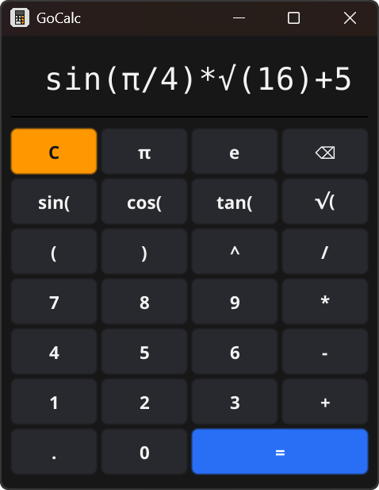
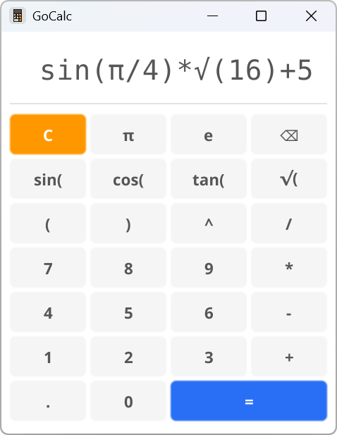

# GoCalc 🧮

**GoCalc** is a cross-platform graphical calculator built with **Go** and the **Fyne** toolkit. It supports trigonometry, constants, and complex nested expressions.

<p align="center">
  
  
</p>

## ✨ Features

- **Advanced Parsing:** Powered by [expr](https://github.com/expr-lang/expr) for safe and efficient math evaluation.
- **Math Functions:** Full support for `sin`, `cos`, `tan`, `sqrt` ($\sqrt{x}$), and exponentiation (`^`).
- **Constants:** Quick access to mathematical constants like $\pi$ and $e$.
- **Cross-Platform:** Native performance on Windows, Linux, and Android.
- **Modern UI:** Clean, responsive interface that adapts to system themes.

## 🧮 Example Expression

Try this to see the parser in action:
`√(sin(π/2) + 2^3 + 7)`  
*Internal evaluation:* `sqrt(1 + 8 + 7)` → **Result: 4**

## 🚀 Getting Started

### Prerequisites
- **Go 1.24.6+**
- C compiler and graphics development headers (required by [Fyne](https://docs.fyne.io/started/quick/)).

### Installation
1. Clone the repository:
    ```bash
    git clone https://github.com/CrispyCl/GoCalc
    cd GoCalc
    ```

2. Install dependencies and run:
    ```bash
    make deps
    make run
    ```

### 🛠 Compilation & Automation
The project uses fyne-cross for seamless multi-platform builds.

```bash
# Build for all supported platforms
make build-all

# Target specific OS
make build-windows
make build-linux
make build-android
```
Binary artifacts will be generated in the fyne-cross/dist/ directory.

You can see all available commands by running:

```bash
make help
```

### 🧪 Quality Assurance

We use **GitHub Actions** for a complete CI/CD pipeline:

- **Unit Tests**: Validating the eval logic.
- **GUI Tests**: Automated interface testing using Xvfb (Virtual Framebuffer) on Linux runners.

To run tests locally:

```bash
make test
```

## 📂 Project Structure

- `cmd/calc/` — Application entry point.
- `internal/calc/` — UI components and display logic (handles button interaction, scrolling, and input validation).
- `internal/eval/` — Calculation engine and string pre-processing logic.
- `.github/workflows/` — Automated CI/CD configurations.
